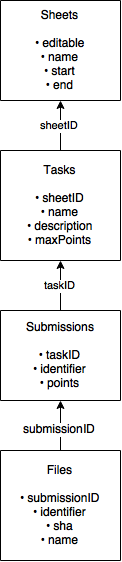

Homework grading system for netsec
==================================

useful for debugging:
```
$ openssl s_client -crlf -connect imap.gmail.com:993
```

Command to start the mail filter system:
```
$ python -m netsecus --only-mail
```

Command to start the web grading server:
```
$ python -m netsecus --only-web
```

Dependencies
======

* tornado
* passlib
* dateutil

Using pip, these can be installed via:

```
$ pip install tornado passlib python-dateutil
```

Server Internal ID management
======

